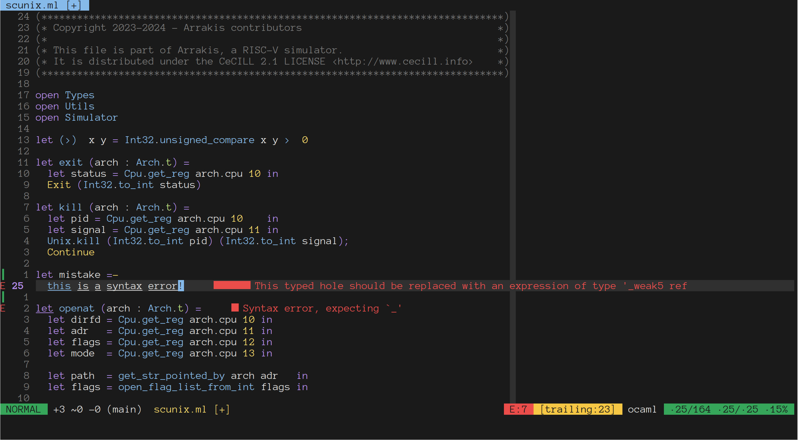

# 💐 Jasmin

A simple colorscheme for Neovim, with support for different plugins !



## 📒 License

`jasmin` is distributed under the [MIT License](./LICENSE).

## 📦 Usage

You must first install `jasmin` with your favorite package manager.

For example, with [lazy.nvim](https://github.com/folke/lazy.nvim):

```lua
{ "gurvan/jasmin.nvim" },
```

You can then simply use it with:

```vim
colorscheme jasmin
```

## 🎨 Palette

`jasmin` mainly relies on 16 colors.
You can easily set your terminal color to match these for a uniform look:

| Code | Color                                                         | Hex code | Code | Color                                                         | Hex Code |
|:----:|:-------------------------------------------------------------:|:--------:|:----:|:-------------------------------------------------------------:|:--------:|
| 0    |  | #1a1a1a  | 8    |  | #303030  |
| 1    |  | #eb4d4b  | 9    |  | #f56664  |
| 2    |  | #36a65b  | 10   |  | #c0e17d  |
| 3    |  | #f6c744  | 11   |  | #f9da6a  |
| 4    |  | #86baeb  | 12   |  | #7cb5f7  |
| 5    |  | #a47de9  | 13   |  | #b58cef  |
| 6    |  | #90e0ef  | 14   |  | #bde0fe  |
| 7    |  | #dfdfdf  | 15   |  | #ffffff  |

## 🔌 Plugin support

* [hardline](https://github.com/ojroques/nvim-hardline)
* [lualine](https://github.com/nvim-lualine/lualine.nvim)
